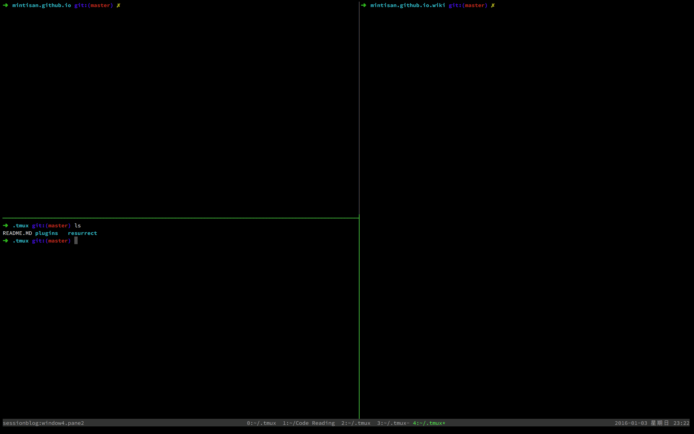

# Oh My [Tmux](http://tmux.github.io/)

> Some Config and Plugin for Easing my operation



1. Clone this [Repo.](https://github.com/hoseahsu/oh-my-tmux) to a path you like, such as `HOME` or anywhere you want:

    ```
    git clone https://github.com/hoseahsu/oh-my-tmux.git ~/oh-my-tmux
    ```

2. Change the directory you just cloned(maybe `cd ~/oh-my-tmux`), and create symbolic link `.tmux.conf` to `$HOME` path

    ```
    ln -s $PWD/oh-my-tmux/tmux.conf ~/.tmux.conf
    ```
> When you execute `echo $PWD` in shell, you will know what the `$PWD` means. 
> Yes, it means the path of current directory you stayed.

3. Install [Tmux Plugin Manager](https://github.com/tmux-plugins/tpm)

    ```
    git clone https://github.com/tmux-plugins/tpm ~/.tmux/plugins/tpm
    ```

4. Startup `Tmux`

    ```
    tmux
    ```

5. Reload Tmux config

    ```
    tmux source ~/.tmux.conf
    ```

6. Install & Update [Tmux](http://tmux.github.io/) plugins via [TPM](https://github.com/tmux-plugins/tpm)

    ```
    Ctrl+b + I # waiting for installed...

    Ctrl+b + U # waiting for updating...

    Ctrl+b + r # let Tmux config work
    ```
or just use below shell after you backup your old tmux.conf

```
sh -c "$(curl -fSL https://raw.githubusercontent.com/hoseahsu/oh-my-tmux/master/install.sh)"
```
